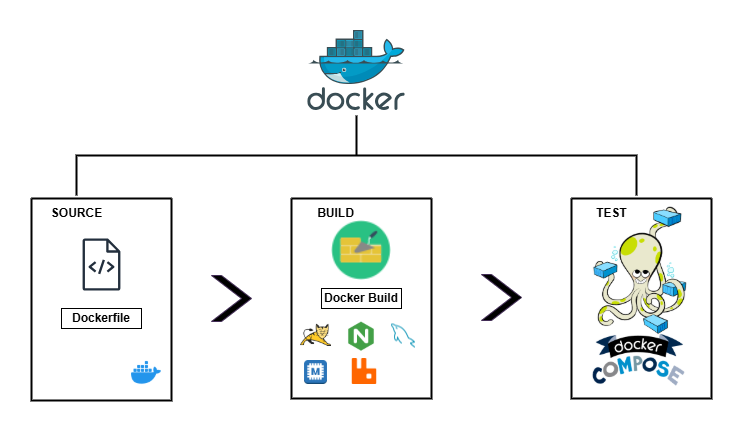

# Multi-Tier Containerized Architecture

This project demonstrates a multi-tier application architecture using containerization and virtualization technologies. It integrates various tools to simulate a production-like environment for educational and testing purposes.



## 📦 Technologies Used

- **Vagrant**: Automates the provisioning of virtual machines.
- **VirtualBox**: Hosts the virtual machines.
- **Docker**: Containerizes application components.
- **Docker Compose**: Manages multi-container Docker applications.
- **Nginx**: Serves as a reverse proxy and load balancer.
- **MySQL**: Provides the relational database service.
- **Shell Scripts**: Automate setup and deployment tasks.

## 🖥️ Virtual Machine Configuration

- **Private IP Address**: `192.168.33.10`
- **Operating System**: Ubuntu 20.04 LTS
- **Resources**:
  - **CPU**: 2 cores
  - **RAM**: 2048 MB
- **Port Forwarding**:
  - **Host Port 8080** → **Guest Port 80** (HTTP)

## 🔐 Application Credentials

- **Username**: `admin_vp`
- **Password**: `admin_vp`

## 🚀 Getting Started

### Prerequisites

Ensure the following software is installed on your host machine:

- [VirtualBox](https://www.virtualbox.org/)
- [Vagrant](https://www.vagrantup.com/)
- [Git](https://git-scm.com/)

### Installation

1. **Clone the Repository**:

   ```bash
   git clone https://github.com/Roberto-1998/multi_tier_containerization.git
   cd multi_tier_containerization/vagrant
   ```

2. **Launch the Virtual Machine**:

   ```bash
   vagrant up
   ```

   This command will:

   - Initialize the virtual machine with the specified configuration.
   - Install Docker and Docker Compose.
   - Deploy the application containers as defined in the `compose.yaml` file.

3. **Access the Application**:

   Open your web browser and navigate to:

   ```
   http://192.168.33.10
   ```

   Use the provided credentials to log in.

## 🧾 Project Structure

```
multi_tier_containerization/
├── README.md
├── architecture/
│   └── multi_tier_containerization.drawio.png
└── vagrant/
    ├── Dockerfiles/
    │   ├── app/
    │   │   └── Dockerfile
    │   ├── db/
    │   │   ├── Dockerfile
    │   │   └── db_backup.sql
    │   └── web/
    │       ├── Dockerfile
    │       └── nginx.conf
    ├── Vagrantfile
    ├── compose.yaml
    └── provisioner/
        └── docker.sh
```

## 📚 Additional Information

- **Provisioning**: The `docker.sh` script automates the installation of Docker and Docker Compose inside the VM.
- **Docker Compose**: Defined in `compose.yaml`, it manages the multi-container setup, including the application, Nginx, and MySQL services.
- **Data Persistence**: MySQL data is initialized using `db_backup.sql` and stored in volumes for persistence.

## 📬 Contact

For questions or feedback, please contact [Roberto-1998](https://github.com/Roberto-1998).
